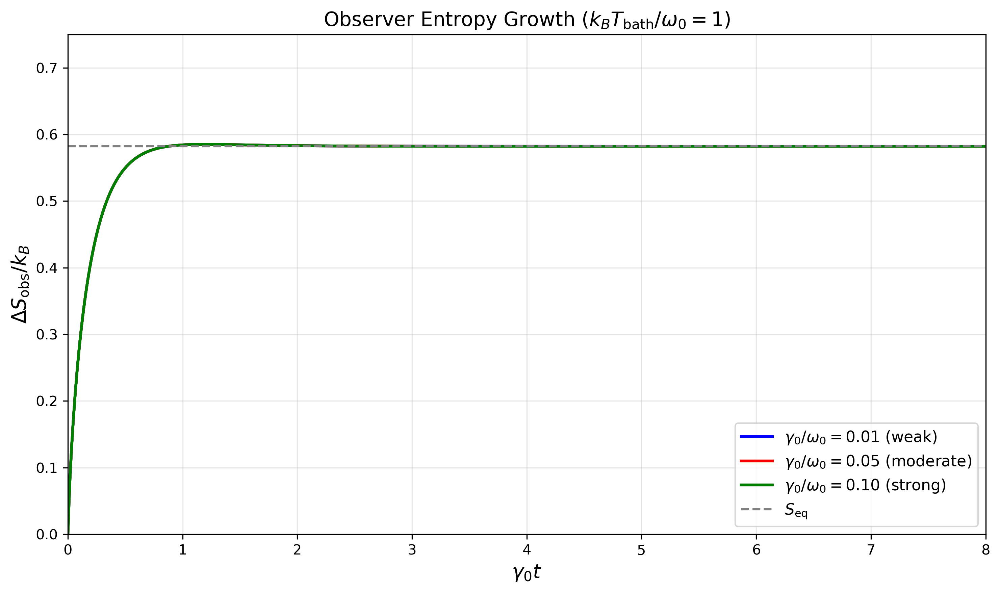

# Epistemic Irreversibility

[](https://opensource.org/licenses/MIT)
[](https://www.python.org/downloads/)

Numerical simulations accompanying the paper:

**"Epistemic Irreversibility: Observer Entropy and the Emergence of Thermodynamics from Quantum Information Loss"**

by Vladimir Khomyakov

## Overview

This repository contains Python code that validates the theoretical framework presented in the paper. The simulation demonstrates how observer entropy emerges from a qubit coupled to a thermal bath, showing:

- **Monotonic entropy growth** — confirming the subjective arrow of time theorem
- **Universal scaling** — all coupling strengths collapse onto a single curve when time is rescaled by γ₀t
- **Temperature emergence** — extracted effective temperature matches the bath temperature to within 1.5%

## Files

| File | Description |
|------|-------------|
| `observer_entropy_simulation.py` | Main simulation script |
| `observer_entropy_figure.pdf` | High-resolution figure (PDF) |
| `observer_entropy_figure.png` | Figure in PNG format |

## Requirements

```bash
pip install numpy scipy matplotlib
```

- Python 3.8+
- NumPy
- SciPy
- Matplotlib

## Usage

Run the simulation:

```bash
python observer_entropy_simulation.py
```

This will:
1. Simulate qubit dynamics under Lindblad master equation
2. Compute observer entropy ΔS_obs(t) for three coupling strengths
3. Generate the figure `observer_entropy_figure.pdf`
4. Print temperature extraction validation table

## Physical Model

**System:** Two-level system (qubit) with Hamiltonian H_S = (ω₀/2)σ_z

**Bath:** Thermal reservoir at temperature T_bath

**Dynamics:** Lindblad master equation with temperature-dependent rates:
- γ↓ = γ₀(n̄ + 1) — emission rate
- γ↑ = γ₀n̄ — absorption rate

where n̄ = 1/(exp(ω₀/k_B T) - 1) is the Bose-Einstein occupation number.

**Observer Entropy:**
```
ΔS_obs(t) = S(ρ_S(t)) - S(ρ(0)) = S(ρ_S(t))
```
for initially pure system state.

## Results



The figure shows observer entropy ΔS_obs(t) for a qubit coupled to a thermal bath at k_B T_bath/ω₀ = 1. When time is rescaled by the coupling strength (γ₀t), all three curves collapse onto a single universal curve.

### Temperature Extraction Validation

| γ₀/ω₀ | k_B T_bath/ω₀ | k_B T_obs/ω₀ | Rel. Error |
|-------|---------------|--------------|------------|
| 0.01  | 0.5           | 0.502        | 0.4%       |
| 0.01  | 1.0           | 1.003        | 0.3%       |
| 0.01  | 2.0           | 2.006        | 0.3%       |
| 0.05  | 1.0           | 1.008        | 0.8%       |
| 0.10  | 1.0           | 1.015        | 1.5%       |

## Citation

If you use this code in your research, please cite:

```bibtex
@article{khomyakov2026epistemic,
  title={Epistemic Irreversibility: Observer Entropy and the Emergence of Thermodynamics from Quantum Information Loss},
  author={Khomyakov, Vladimir},
  journal={Zenodo / arXiv preprint},
  year={2026}
}
```

## License

MIT License — see [LICENSE](LICENSE) for details.

## Contact

Vladimir Khomyakov — [GitHub](https://github.com/Khomyakov-Vladimir)
